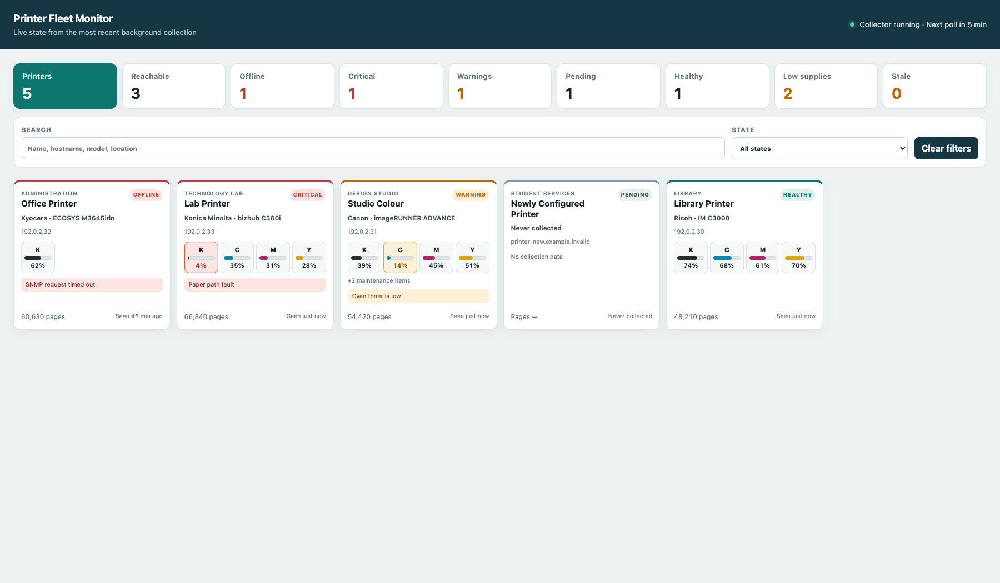
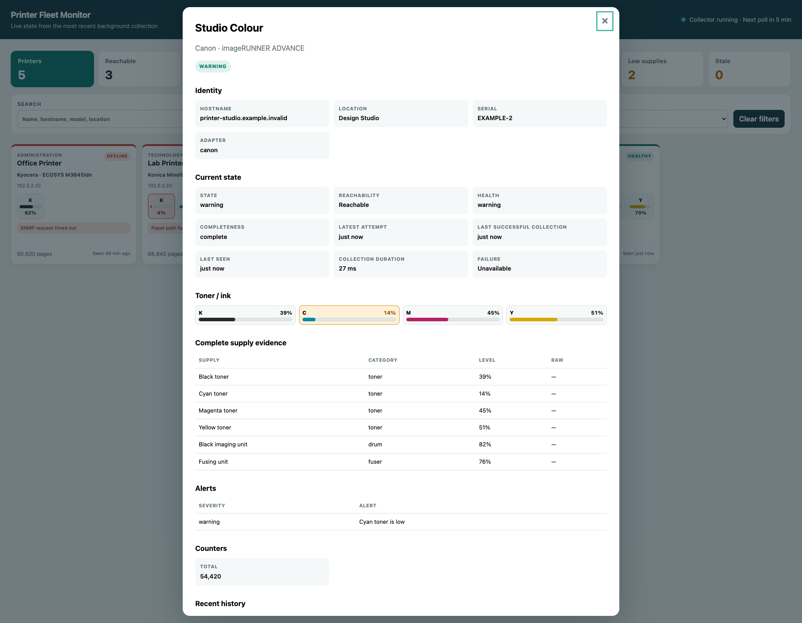

# Printer Fleet Monitor

Printer Fleet Monitor is a self-hosted, multi-vendor monitor for network printers and multifunction devices. It gives operators one compact dashboard for fleet health, reachability, toner, counters, alerts, freshness, filtering, device detail, and recent history. A background collector reads printers over read-only SNMP and caches normalized observations in SQLite; the dashboard and API read only that cached state and never synchronously poll a printer.



## Highlights

- Reachability, health, freshness, and never-collected state as separate signals
- Toner/ink and maintenance supplies, including unknown or device-specific raw levels
- Active alerts, total page count, and recent collection history
- Collection completeness, latency, failure evidence, and adapter selection
- A compact fleet overview with searchable/filterable cards and a scroll-contained Printer Detail view
- Mixed hostname/IPv4 fleets with friendly operator-defined printer names
- Per-poll DNS resolution for hostname targets and direct polling for IP targets

No device-changing operation is implemented. Collection is limited to SNMP GET and subtree reads; there is no SNMP SET path, browser-triggered polling, network scanning, or discovery.

## Architecture

```text
hostname or IP inventory
          │
          ▼
background collector ── DNS when needed ── read-only SNMP GET/subtree
          │
          ▼
        SQLite  ◄── Fastify API ◄── browser dashboard
```

Production inventory is target-based: each enabled printer has exactly one hostname or IP target. Hostnames are preferred where reliable DNS exists; IP targets support environments without printer DNS. Each printer also has a stable inventory ID so metadata or connection targets can change without losing history. The collector stores append-only observations plus a materialized latest state; failed polls preserve clearly labelled last-known device data without rewriting history.

Reachability answers whether the latest SNMP attempt received a response. Health describes the normalized condition of a responding device (`healthy`, `warning`, `critical`, or `unknown`). Freshness is independent of both. An active printer without any observation is `pending`, not offline.

The supported single-node runtime is one collector writer and one API/web process sharing a local SQLite database. On macOS, launchd supervises them as independent services, so either can restart without coupling its lifecycle to the other. See [Architecture](docs/ARCHITECTURE.md) for the component and storage boundaries.

## Vendor support

Live validation currently covers Konica Minolta and FUJIFILM devices. The generic collector uses SNMPv2-MIB, HOST-RESOURCES-MIB, and Printer-MIB, while the adapter architecture provides a controlled path for additional vendors. Vendor adapters normalize standard evidence behind shared contracts; they do not currently add private enterprise-OID queries.

| Vendor | Repository evidence |
| --- | --- |
| Konica Minolta | Sanitized fixture regressions for bizhub C3321i, C301i, C451i, and C251i; enterprise OID `18334` selects the adapter. |
| FUJIFILM | Sanitized Apeos C3567 fixture through the generic standard-MIB path. |
| Ricoh | Enterprise OID `367` adapter detection and deterministic synthetic coverage; live validation pending. |
| Canon | Enterprise OID `1602` adapter detection and deterministic synthetic coverage; live validation pending. |
| Kyocera | Enterprise OID `1347`/identity adapter detection and deterministic synthetic coverage; live validation pending. |

“Fixture” means sanitized evidence committed under `packages/collector/test/fixtures/`; it is not a claim that every model or firmware behaves identically.

## Quick start on macOS

Requirements: Node.js 22.12 or newer and npm 10 or newer.

```bash
git clone https://github.com/thehallifax/printmonitor.git
cd printmonitor
cp .env.example .env
cp config/inventory.example.yaml config/inventory.yaml
# Edit .env and config/inventory.yaml using the mixed-target example below.
./scripts/install.sh --dry-run
./scripts/install.sh
./scripts/status.sh
```

The installer validates configuration, installs locked dependencies, builds the project, and installs separate per-user launchd agents for the API/web process and collector. It is idempotent and never overwrites an existing `.env`, inventory, database, or log. The documented default is <http://127.0.0.1:3010>; installation and status output use the effective `HOST` and `PORT`.

## Operate and update

Installed services run in the background, so Terminal can be closed. They are per-user LaunchAgents and normally start after the installing user logs in following a reboot; they are not pre-login system daemons.

| Command | Purpose |
| --- | --- |
| `./scripts/install.sh` | Perform the initial build and install the background services. |
| `./scripts/start.sh` | Start services that are already installed. |
| `./scripts/stop.sh` | Stop/unload services while retaining their installation, configuration, and data. |
| `./scripts/restart.sh` | Restart the installed services. |
| `./scripts/status.sh` | Show current service state, dashboard URL, and log paths. |
| `./scripts/update.sh` | Perform the normal application update workflow. |
| `./scripts/uninstall.sh` | Remove the launchd installation while preserving operator configuration and data. |
| `./scripts/run.sh` | Run the API/web and collector manually in the foreground. |

For an existing installation, the canonical update command is:

```bash
~/printmonitor/scripts/update.sh
# or, from the repository:
./scripts/update.sh
```

`update.sh` safely performs the fast-forward-only pull, locked dependency install, build, tests, service restart, status verification, and local API health verification. Normal updates run tests. Use `./scripts/update.sh --verbose` for detailed command output, or use `./scripts/update.sh --skip-tests` only as an explicitly accepted faster path. The scripts resolve Node/npm themselves; do not source NVM or other interactive shell setup. See [Deployment](docs/DEPLOYMENT.md) for service labels, log paths, upgrades, and troubleshooting.

## Foreground run

Run both the API/web process and collector watch loop in one terminal without installing services:

```bash
./scripts/run.sh
```

This foreground mode is for development or supervised troubleshooting; Terminal must remain open, and it is not required for a normal launchd deployment. `run.sh` safely parses the repository-root `.env` without shell evaluation, forwards `SIGINT`/`SIGTERM`, and stops the other child if either process exits. Exported environment variables override `.env`, which overrides documented defaults. All supported launch paths resolve relative inventory and database paths from the repository root.

For a UI-only local demo with fictional stored records:

```bash
npm ci
npm run demo:seed
npm run dev
```

The demo uses `.invalid` hostnames, RFC 5737 documentation addresses, and `EXAMPLE-*` serials. It performs no network collection.

## Configuration and inventory

Keep `.env` and `config/inventory.yaml` out of source control: they can contain an SNMP credential and site-identifying data. Use a read-only SNMP community. `INVENTORY_PATH` must point to the operator inventory, not the committed example.

```yaml
site:
  id: example-campus
  name: Example Campus

printers:
  - id: reception
    hostname: reception-printer.example.invalid
    displayName: Reception Copier
    location: Reception

  - id: library
    ip: 192.0.2.42
    displayName: Library Copier
    location: Library
```

Each printer must define exactly one connection target: `hostname` or `ip`, never both. Hostnames are preferred where reliable DNS exists and are resolved on every collection; an IPv4 target is supported when DNS is unavailable and is polled directly without reverse lookup. Mixed hostname/IP fleets are supported. CIDRs, ranges, wildcards, and discovery syntax are rejected.

The `id` is the printer's stable internal identity. Keep it unchanged to preserve logical identity and history if the connection target changes—for example, when `hostname: library-printer.example.invalid` is later replaced by `ip: 192.0.2.42`. `displayName` is the preferred operator-facing name, so operators can use meaningful labels such as `Library Copier`, `Administration Copier`, or `Staffroom Printer` instead of generic names such as `Printer 101`.

The explicit `--ip` live-validation option remains diagnostic-only and never creates or modifies inventory. SNMP credentials are read from the environment and are not written to launchd plist files.

Important settings are `SNMP_COMMUNITY`, `INVENTORY_PATH`, `DATABASE_PATH`, `POLL_INTERVAL_SECONDS`, `SNMP_TIMEOUT_MS`, `SNMP_RETRIES`, `COLLECTOR_CONCURRENCY`, `HOST`, and `PORT`. See [.env.example](.env.example) and [Development](docs/DEVELOPMENT.md) for bounds and precedence details.

## Dashboard and detail

Fleet cards show priority-ordered operational state, K/C/M/Y levels, concise maintenance and alert summaries, page count, and recency. Summary metrics and the State selector filter the already-loaded stored fleet; dashboard refreshes are API reads, not printer polls.

Printer Detail exposes identity, reachability, health, completeness, all supply evidence, alerts, counters, and bounded recent history. It initially shows the latest 12 fetched observations; Show more exposes the rest of that fetched recent history. Underlying observations remain stored, with no destructive retention/downsampling currently applied. Forecasting, toner-consumption intelligence, replacement detection, and long-term trend analysis are future work. The fictional example below includes toner, imaging-unit, and fuser evidence.



## API

- `GET /api/health` — API, database, and collector runtime status
- `GET /api/fleet` — fleet summary and current printer state
- `GET /api/printers` — current states with search and operational filters
- `GET /api/printers/:id` — one current stored printer state
- `GET /api/printers/:id/history?limit=25` — bounded recent history, capped at 100
- `GET /api/runs` and `GET /api/runs/:id` — collection-run diagnostics

## Development and diagnostics

Normal operators use the lifecycle commands above. See [Development](docs/DEVELOPMENT.md) for local builds, tests, demo data, and direct collector commands; see [controlled live validation](docs/LIVE_VALIDATION.md) for the explicitly authorized single-printer diagnostic workflow.

## Security model

- Exactly one hostname or IPv4 target per printer; DNS remains mandatory for hostname targets
- Read-only SNMP GET/subtree surface with bounded timeout, retries, and concurrency
- No scanning, discovery, traps, device writes, or browser-to-printer path
- Credentials remain server-side and are excluded from generated service definitions and logs
- Live validation is single-target and explicitly operator initiated; captures stay under ignored `data/private/live-validation/` until sanitized and reviewed

See [SNMP behavior](docs/SNMP.md) and [controlled live validation](docs/LIVE_VALIDATION.md) for the exact collection and fixture workflow.

## Current limitations

- SNMPv2c only; credentials are process-level configuration rather than secret-store integration.
- Standard-MIB collection only; vendor adapters currently normalize/detect rather than query private OIDs.
- Alert descriptions vary by implementation, and mono/colour counters are not yet available through the generic path.
- SNMP response is the reachability signal; there is no independent ICMP/TCP probe.
- Production IP targets are individual IPv4 literals only; CIDRs and ranges are not supported.
- No authentication, notifications, network discovery, traps, or multi-site control plane.
- The supported deployment is one local SQLite database with one collector writer; multiple simultaneous collectors against the same database are unsupported.
